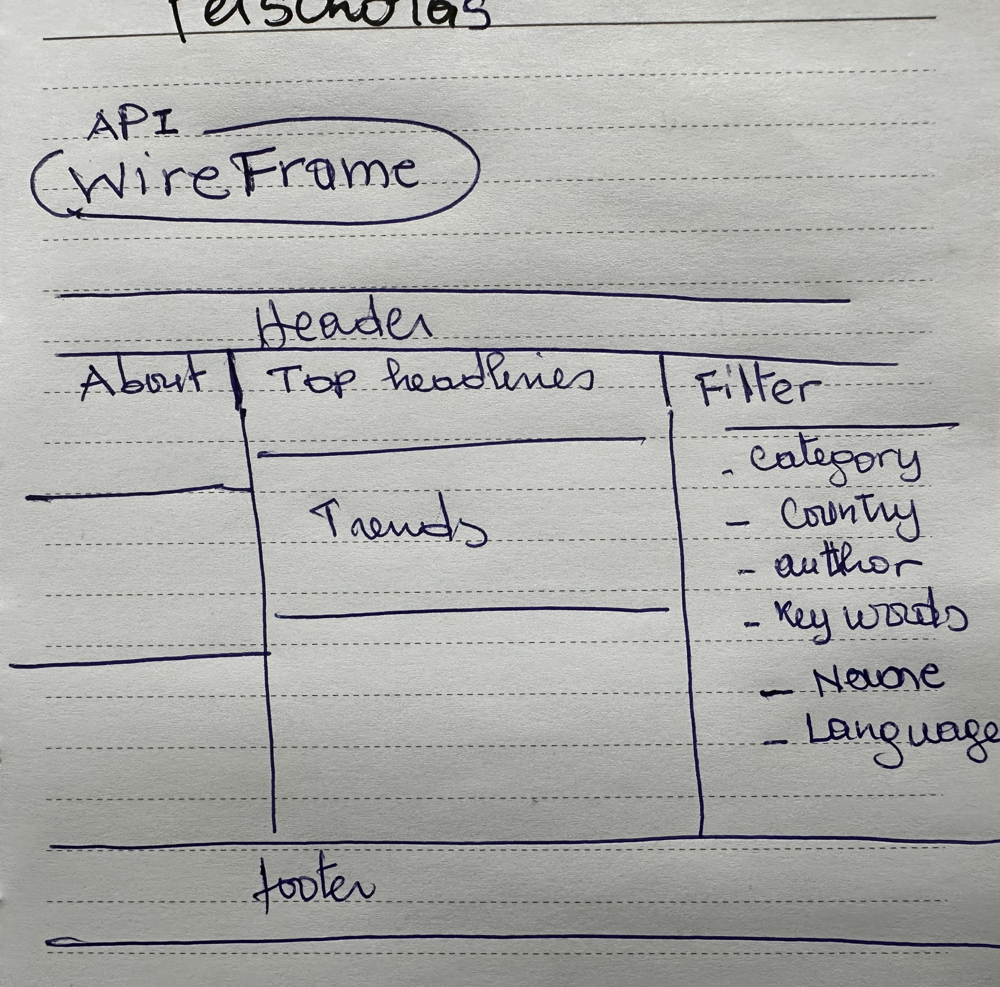

# News App

News APP is an amazing source of information as it provides a single API that exposes breaking news headlines and older articles from over 3,000 news sources.

By filtering by country or selecting by author and keywords, you can get specific articles from publishers in a country needed.

## Available Countries
Country 	2-letter ISO 3166-1 code
🇮🇳 India    	in
🇺🇸 USA	    us
🇦🇺 Australia    	au
🇷🇺 Russia	        ru
🇫🇷 France       	fr
🇬🇧 United Kingdom   	gb

## Wireframe

## What I learned
- Using of useeffect hook to fetch data using routers
- Using hash router to duplicate dummy data to avoid paying for  request
- Master the step-by- step process to create an application
- How to deploy an app

## Difficulties
- require API KEY
- do not allow free request from browser only for development.

## deployment link

https://georgetteolinga.github.io/REACT_Project_newsapi/

I did not realize it until deployment, but this news API does not allow free requests from the browser. They only allow free requests from localhost. So in deployment I am using dummy data.